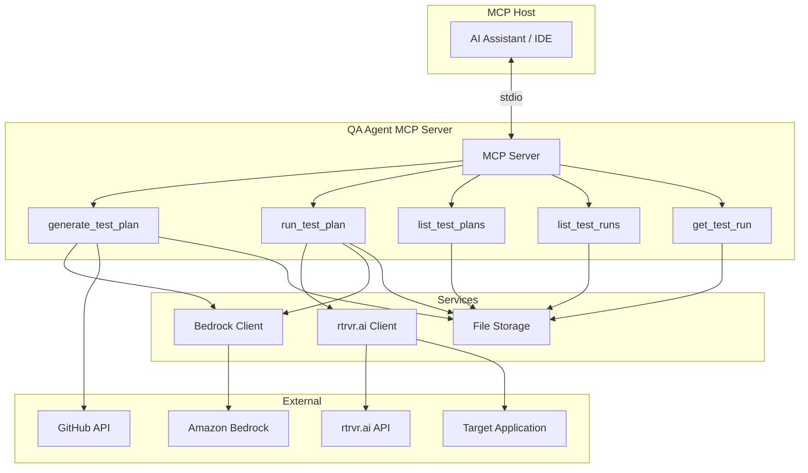
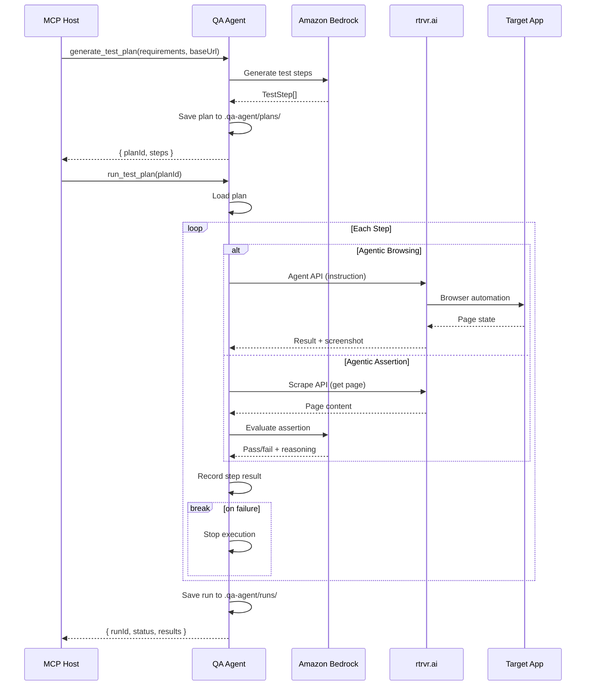

# QA Agent - Detailed Design

## Overview

The QA Agent is an AI-powered quality assurance tool that generates and executes test plans against frontend applications. It accepts plain English requirements and a GitHub repository URL, generates structured test plans, and executes them using agentic browser automation via rtrvr.ai.

The agent is exposed as an MCP (Model Context Protocol) server, allowing integration with AI assistants and development tools.

## Detailed Requirements

### Functional Requirements

1. **Test Plan Generation**
   - Accept plain English requirements as input
   - Accept GitHub repo URL or PR URL for codebase context
   - Generate structured test plans with multiple step types
   - Store the original prompt for reproducibility

2. **Test Plan Execution**
   - Execute test plans against a running frontend application
   - Support four step types:
     - Agentic browsing (AI-driven browser interaction via rtrvr.ai)
     - Selenese browsing (scripted browser commands)
     - Unit assertions (deterministic checks)
     - Agentic assertions (LLM-as-judge for non-deterministic validation)
   - Stop execution immediately on first failure
   - Support parallel execution of tests and test plans

3. **Test Results Management**
   - Capture pass/fail status per step
   - Capture screenshots/visual evidence
   - Record timing/duration metrics
   - Store LLM reasoning for AI assertions
   - Log full request/response data

4. **Storage**
   - Persist test plans as JSON files in `.qa-agent/` directory
   - Organize plans by project (inferred from GitHub repo)
   - Store test runs with full evidence

5. **MCP Interface**
   - Expose five tools: `generate_test_plan`, `run_test_plan`, `list_test_plans`, `list_test_runs`, `get_test_run`

### Non-Functional Requirements

- Target: Frontend applications (extensible to CLI/backend)
- Language: TypeScript/Node.js
- LLM Provider: Amazon Bedrock
- Browser Automation: rtrvr.ai Agent API
- No authentication required for target applications (initial prototype)

## Architecture Overview



## Components and Interfaces

### MCP Server (`src/index.ts`)

Entry point that registers tools and handles MCP protocol communication.

```typescript
interface ServerConfig {
  name: string;
  version: string;
}
```

### Tools

#### generate_test_plan

Generates a test plan from requirements.

**Input:**
```typescript
interface GenerateTestPlanInput {
  requirements: string;      // Plain English requirements (required)
  repoUrl?: string;          // GitHub repo or PR URL
  baseUrl: string;           // Target application URL (required)
  name?: string;             // Test plan name (auto-generated if omitted)
}
```

**Output:**
```typescript
interface GenerateTestPlanOutput {
  planId: string;
  name: string;
  steps: number;
  path: string;              // File path where plan is saved
}
```

#### run_test_plan

Executes a test plan.

**Input:**
```typescript
interface RunTestPlanInput {
  planId: string;            // Test plan ID (required)
  baseUrl?: string;          // Override base URL
}
```

**Output:**
```typescript
interface RunTestPlanOutput {
  runId: string;
  status: 'passed' | 'failed' | 'error';
  duration: number;
  stepsExecuted: number;
  stepsPassed: number;
  failedStep?: string;
}
```

#### list_test_plans

Lists available test plans.

**Input:**
```typescript
interface ListTestPlansInput {
  project?: string;          // Filter by project name
}
```

**Output:**
```typescript
interface ListTestPlansOutput {
  plans: Array<{
    id: string;
    name: string;
    project: string;
    stepCount: number;
    createdAt: string;
  }>;
}
```

#### list_test_runs

Lists test run executions.

**Input:**
```typescript
interface ListTestRunsInput {
  planId?: string;           // Filter by plan ID
  status?: 'passed' | 'failed' | 'running';
}
```

**Output:**
```typescript
interface ListTestRunsOutput {
  runs: Array<{
    id: string;
    planId: string;
    planName: string;
    status: string;
    duration?: number;
    startedAt: string;
  }>;
}
```

#### get_test_run

Gets details of a specific test run.

**Input:**
```typescript
interface GetTestRunInput {
  runId: string;             // Test run ID (required)
}
```

**Output:** Full `TestRun` object (see Data Models).

### Services

#### BedrockClient (`src/services/bedrock-client.ts`)

Handles LLM interactions for test plan generation and agentic assertions.

```typescript
interface BedrockClient {
  generateTestPlan(prompt: string, context?: string): Promise<TestStep[]>;
  evaluateAssertion(instruction: string, criteria: string, pageContent: string): Promise<AssertionResult>;
}

interface AssertionResult {
  passed: boolean;
  reasoning: string;
  confidence: number;
}
```

#### RtrvrClient (`src/services/rtrvr-client.ts`)

Handles browser automation via rtrvr.ai.

```typescript
interface RtrvrClient {
  executeAgenticStep(instruction: string, baseUrl: string, trajectoryId?: string): Promise<AgentResponse>;
  scrapePage(url: string): Promise<ScrapeResponse>;
}

interface AgentResponse {
  success: boolean;
  result?: any;
  screenshot?: string;
  error?: string;
  trajectoryId: string;
}
```

#### Storage (`src/services/storage.ts`)

Handles file-based persistence.

```typescript
interface Storage {
  savePlan(plan: TestPlan): Promise<string>;
  getPlan(planId: string): Promise<TestPlan | null>;
  listPlans(project?: string): Promise<TestPlanSummary[]>;
  saveRun(run: TestRun): Promise<string>;
  getRun(runId: string): Promise<TestRun | null>;
  listRuns(filters?: RunFilters): Promise<TestRunSummary[]>;
}
```

## Data Models

### TestPlan

```typescript
interface TestPlan {
  id: string;
  name: string;
  description: string;
  project: {
    name: string;
    repoUrl?: string;
    description?: string;
  };
  prompt: string;
  baseUrl: string;
  steps: TestStep[];
  createdAt: string;
  updatedAt: string;
}
```

### TestStep (Union Type)

```typescript
type TestStep = 
  | AgenticBrowsingStep 
  | SelenesesStep 
  | UnitAssertionStep 
  | AgenticAssertionStep;

interface BaseStep {
  id: string;
  name: string;
}

interface AgenticBrowsingStep extends BaseStep {
  type: 'agentic_browsing';
  instruction: string;
  expectedOutcome?: string;
  timeout?: number;
}

interface SelenesesStep extends BaseStep {
  type: 'selenese';
  commands: SelenesesCommand[];
}

interface SelenesesCommand {
  command: 'open' | 'click' | 'type' | 'waitForElement' | 'assertText' | 'assertVisible';
  target: string;
  value?: string;
}

interface UnitAssertionStep extends BaseStep {
  type: 'unit_assertion';
  assertions: UnitAssertion[];
}

interface UnitAssertion {
  type: 'equals' | 'contains' | 'matches' | 'exists' | 'visible';
  selector?: string;
  property?: string;
  expected: string | boolean | number;
}

interface AgenticAssertionStep extends BaseStep {
  type: 'agentic_assertion';
  instruction: string;
  criteria: string;
  context?: string;
}
```

### TestRun

```typescript
interface TestRun {
  id: string;
  planId: string;
  planName: string;
  status: 'running' | 'passed' | 'failed' | 'error';
  startedAt: string;
  completedAt?: string;
  duration?: number;
  baseUrl: string;
  stepResults: StepResult[];
  error?: string;
}

interface StepResult {
  stepId: string;
  stepName: string;
  stepType: TestStep['type'];
  status: 'passed' | 'failed' | 'skipped' | 'error';
  startedAt: string;
  completedAt: string;
  duration: number;
  screenshot?: string;
  logs?: string[];
  llmReasoning?: string;
  llmConfidence?: number;
  expected?: any;
  actual?: any;
  error?: string;
}
```

## Error Handling

### Error Types

```typescript
enum QAAgentError {
  PLAN_NOT_FOUND = 'PLAN_NOT_FOUND',
  RUN_NOT_FOUND = 'RUN_NOT_FOUND',
  INVALID_INPUT = 'INVALID_INPUT',
  RTRVR_ERROR = 'RTRVR_ERROR',
  BEDROCK_ERROR = 'BEDROCK_ERROR',
  STORAGE_ERROR = 'STORAGE_ERROR',
  EXECUTION_FAILED = 'EXECUTION_FAILED',
}
```

### Error Responses

All tools return errors in a consistent format:
```typescript
interface ErrorResponse {
  error: {
    code: QAAgentError;
    message: string;
    details?: any;
  };
}
```

## Testing Strategy

### Unit Tests
- Test each service in isolation with mocked dependencies
- Test data model serialization/deserialization
- Test step execution logic for each step type

### Integration Tests
- Test MCP tool handlers with mocked services
- Test storage operations against real filesystem
- Test Bedrock client with mocked AWS SDK

### End-to-End Tests
- Test full flow: generate plan → run plan → get results
- Use a simple test application (e.g., static HTML page)
- Verify rtrvr.ai integration with real API calls

## Appendices

### A. Technology Choices

| Component | Choice | Rationale |
|-----------|--------|-----------|
| Language | TypeScript | Type safety, MCP SDK support |
| Runtime | Node.js | MCP SDK compatibility, async I/O |
| LLM | Amazon Bedrock | AWS integration, Claude models |
| Browser Automation | rtrvr.ai | Agentic browsing, managed infrastructure |
| Storage | JSON files | Simple, portable, human-readable |
| MCP Transport | stdio | Standard for local MCP servers |

### B. Directory Structure

```
qa-agent/
├── src/
│   ├── index.ts                 # MCP server entry point
│   ├── tools/
│   │   ├── index.ts             # Tool registration
│   │   ├── generate-test-plan.ts
│   │   ├── run-test-plan.ts
│   │   ├── list-test-plans.ts
│   │   ├── list-test-runs.ts
│   │   └── get-test-run.ts
│   ├── services/
│   │   ├── bedrock-client.ts
│   │   ├── rtrvr-client.ts
│   │   └── storage.ts
│   ├── executor/
│   │   ├── index.ts             # Test runner orchestration
│   │   ├── agentic-browsing.ts
│   │   ├── selenese.ts
│   │   ├── unit-assertion.ts
│   │   └── agentic-assertion.ts
│   └── types/
│       ├── test-plan.ts
│       ├── test-run.ts
│       └── errors.ts
├── package.json
├── tsconfig.json
└── README.md
```

### C. Configuration

Environment variables:
```
RTRVR_API_KEY=rtrvr_xxx          # rtrvr.ai API key
AWS_REGION=us-east-1             # Bedrock region
BEDROCK_MODEL_ID=anthropic.claude-3-sonnet  # Model for generation
```

### D. Execution Flow



### E. Alternative Approaches Considered

1. **Database vs File Storage**: Chose JSON files for simplicity and portability. Database could be added later for scale.

2. **Playwright vs rtrvr.ai**: rtrvr.ai provides managed infrastructure and agentic capabilities out of the box, reducing complexity.

3. **Single LLM vs Multiple**: Starting with Bedrock only. Could add abstraction layer for multiple providers later.

4. **Synchronous vs Async Execution**: Chose synchronous step execution with async I/O. Parallel plan execution can be handled at the caller level.
