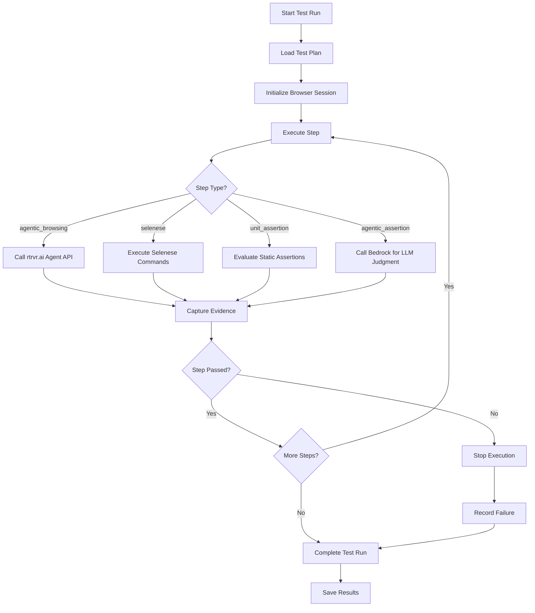

# Test Plan Structure Research

## Overview

This document explores patterns for structuring test plans with multiple step types, supporting both deterministic and AI-driven assertions.

## Test Plan Data Model

### Core Structure
```typescript
interface TestPlan {
  id: string;
  name: string;
  description: string;
  project: {
    name: string;
    repoUrl?: string;
    description?: string;
  };
  prompt: string;              // Original plain English prompt
  baseUrl: string;             // Target application URL
  steps: TestStep[];
  createdAt: string;
  updatedAt: string;
}
```

### Step Types

Based on requirements, four step types are needed:

#### 1. Agentic Browsing Step
Uses rtrvr.ai Agent API for AI-driven browser interaction.

```typescript
interface AgenticBrowsingStep {
  type: 'agentic_browsing';
  id: string;
  name: string;
  instruction: string;         // Natural language instruction
  expectedOutcome?: string;    // What should happen
  timeout?: number;            // Max execution time (ms)
}
```

#### 2. Selenese Browsing Step
Scripted browser commands for deterministic actions.

```typescript
interface SelenesesStep {
  type: 'selenese';
  id: string;
  name: string;
  commands: SelenesesCommand[];
}

interface SelenesesCommand {
  command: 'open' | 'click' | 'type' | 'waitForElement' | 'assertText' | 'assertVisible';
  target: string;              // CSS selector or URL
  value?: string;              // Input value or expected text
}
```

#### 3. Unit Assertion Step
Static/deterministic assertions with exact expected values.

```typescript
interface UnitAssertionStep {
  type: 'unit_assertion';
  id: string;
  name: string;
  assertions: UnitAssertion[];
}

interface UnitAssertion {
  type: 'equals' | 'contains' | 'matches' | 'exists' | 'visible';
  selector?: string;           // CSS selector for element
  property?: string;           // Property to check (text, value, href, etc.)
  expected: string | boolean | number;
}
```

#### 4. Agentic Assertion Step
AI-driven assertions for non-deterministic validation (LLM-as-judge).

```typescript
interface AgenticAssertionStep {
  type: 'agentic_assertion';
  id: string;
  name: string;
  instruction: string;         // What to evaluate
  criteria: string;            // Success criteria in plain English
  context?: string;            // Additional context for LLM
}
```

### Unified Step Type
```typescript
type TestStep = 
  | AgenticBrowsingStep 
  | SelenesesStep 
  | UnitAssertionStep 
  | AgenticAssertionStep;
```

## Test Run Data Model

```typescript
interface TestRun {
  id: string;
  planId: string;
  planName: string;
  status: 'running' | 'passed' | 'failed' | 'error';
  startedAt: string;
  completedAt?: string;
  duration?: number;           // Total duration in ms
  baseUrl: string;
  stepResults: StepResult[];
  error?: string;              // Top-level error if any
}

interface StepResult {
  stepId: string;
  stepName: string;
  stepType: TestStep['type'];
  status: 'passed' | 'failed' | 'skipped' | 'error';
  startedAt: string;
  completedAt: string;
  duration: number;
  
  // Evidence
  screenshot?: string;         // Base64 or file path
  logs?: string[];             // Request/response logs
  
  // For agentic steps
  llmReasoning?: string;       // LLM's explanation
  llmConfidence?: number;      // 0-1 confidence score
  
  // For assertions
  expected?: any;
  actual?: any;
  
  error?: string;
}
```

## Directory Structure

```
.qa-agent/
├── plans/
│   ├── {project-name}/
│   │   ├── {plan-id}.json
│   │   └── {plan-id}.json
│   └── {project-name}/
│       └── {plan-id}.json
└── runs/
    ├── {run-id}.json
    └── {run-id}.json
```

## Example Test Plan JSON

```json
{
  "id": "tp_abc123",
  "name": "User Login Flow",
  "description": "Verify user can log in and see dashboard",
  "project": {
    "name": "my-app",
    "repoUrl": "https://github.com/org/my-app",
    "description": "Main web application"
  },
  "prompt": "Test that a user can navigate to the login page, enter credentials, and see the dashboard",
  "baseUrl": "http://localhost:3000",
  "steps": [
    {
      "type": "agentic_browsing",
      "id": "step_1",
      "name": "Navigate to login",
      "instruction": "Go to the homepage and click the Login button"
    },
    {
      "type": "unit_assertion",
      "id": "step_2",
      "name": "Verify login form",
      "assertions": [
        {
          "type": "visible",
          "selector": "input[name='email']",
          "expected": true
        },
        {
          "type": "visible",
          "selector": "input[name='password']",
          "expected": true
        }
      ]
    },
    {
      "type": "agentic_browsing",
      "id": "step_3",
      "name": "Submit login form",
      "instruction": "Enter test@example.com as email, password123 as password, and click Submit"
    },
    {
      "type": "agentic_assertion",
      "id": "step_4",
      "name": "Verify dashboard loaded",
      "instruction": "Check if the dashboard page is displayed",
      "criteria": "The page should show a welcome message and navigation menu"
    }
  ],
  "createdAt": "2026-01-31T10:00:00Z",
  "updatedAt": "2026-01-31T10:00:00Z"
}
```

## Execution Flow



## Parallel Execution Considerations

For parallel test execution:
- Each test plan runs in its own browser session (via rtrvr.ai trajectoryId)
- Steps within a plan execute sequentially (dependencies)
- Multiple plans can run concurrently
- Use unique run IDs to track parallel executions

## References
- Selenese command reference: https://www.selenium.dev/selenium-ide/docs/en/api/commands
- JSON Schema for validation: https://json-schema.org/
